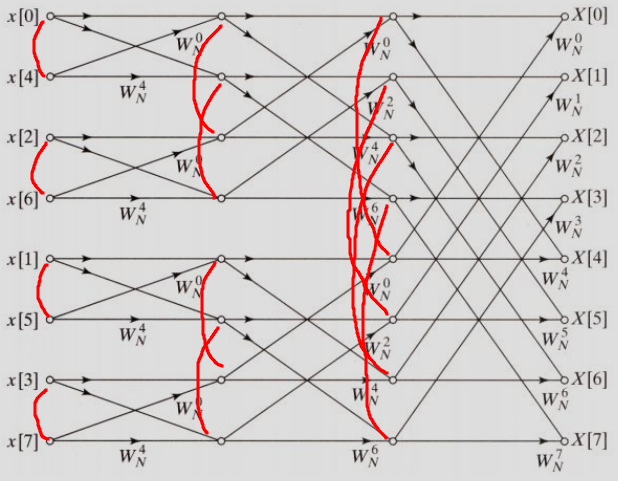

# FFT


## Complex Number Struct
```c
struct comp {
  double x, y;
  comp(double x = .0, double y = .0) : x(x), y(y) {}
  inline comp conj() { return comp(x, -y); }
};

inline comp operator +(const comp& a, const comp& b) {
  return comp(a.x + b.x, a.y + b.y);
}

inline comp operator -(const comp& a, const comp& b) {
  return comp(a.x - b.x, a.y - b.y);
}

inline comp operator *(const comp& a, const comp& b) {
  return comp(a.x * b.x - a.y * b.y, a.x * b.y + a.y * b.x);
}

inline comp operator /(const comp& a, const double& b) {
  return comp(a.x / b, a.y / b);
}

```

It defines a complex number struct, and its `+, -, *, /` calculation.


## Namespace FFT
### precalc

```c
const double PI = acosl(-1.0);
vector<comp> w[LOGN];
vector<int> rv;

void precalc() {
  forn(st, LOGN) {
    w[st].resize(1 << st);
    forn(i, 1 << st) {
      double ang = PI / (1 << st) * i;
      w[st][i] = comp(cos(ang), sin(ang));
    }
  }

  rv.assign(1 << LOGN, 0);
  fore(i, 1, sz(rv)) {
    rv[i] = (rv[i >> 1] >> 1) | ((i & 1) << (LOGN - 1));
  }
}

```

w means omega, means rotation factors.

$$
e^{\frac{2\pi i}{n}}
$$

Here only pi because we divide to 2.<br>
st means n.<br>
w[st][i] is the value in complex number.<br>
rv is reverse bits, size = 2^LOGN.<br>
if 5 in 4 bits(0101), rv will be 10(1010).


### multiply
```c
int ln = 1;
while (ln < (sza + szb)) {
  ln <<= 1;
}

forn(i, ln) {
  aa[i] = (i < sza ? a[i] : comp());
}
forn(i, ln) {
  bb[i] = (i < szb ? b[i] : comp());
}
```

if a, b polynomial is power 2 and 3<br>
sza + szb = 5<br>
we get minimal 2^3 = 8 > 5<br>
ln = 8<br>

<br>

then we copy a to aa, other in 0


```c
fft(aa, ln, false);
fft(bb, ln, false);

forn(i, ln) {
  cc[i] = aa[i] * bb[i];
}

fft(cc, ln, true);

szc = ln;
forn(i, szc) {
  c[i] = int(cc[i].x + 0.5);
}
```
do fft on aa and bb<br>
multiply aa and bb<br>
do reverse fft on cc<br>
normalize cc becuase it's double, use rounding to get int

### fft
```c
int ln = __builtin_ctz(n);
forn(i, n) {
  int ni = rv[i] >> (LOGN - ln);
  if (i < ni)
    swap(a[i], a[ni]);
}
```

```c
int ni = rv[i] >> (LOGN - ln);
```
<br>
get ln = log2(n)<br>
get a[idx],  idx = reverse bit<br>
<br>


```c
for(int st = 0; st < ln; st++) {
  int len = 1 << st;
  for(int k = 0; k < n; k+=(len << 1)) {
    fore(pos, k, k+len) {
      comp l = a[pos];
      comp r = a[pos+len] * w[st][pos-k];

      a[pos] = l + r;
      a[pos+len] = l - r;
    }
  }
}
```

<br>
```c
for(int st = 0; st < ln; st++)
```
<br>
st = each steps, in this img = 3

```c
int len = 1 << st;
```
<br>
len = stride = $2^{st}$, in this img, 1, 2, 4

```c
for(int k = 0; k < n; k+=(len << 1))
```
<br>
k = how many steps in each st, in this img, 4, 2, 1

```c
fore(pos, k, k+len) {
  comp l = a[pos];
  comp r = a[pos+len] * w[st][pos-k];

  a[pos] = l + r;
  a[pos+len] = l - r;
}
```
<br>
calculation


```c
if (inv) {
  forn(i, n) {
    a[i] = a[i] / n;
  }
  reverse(a+1, a+n);
}
```
reverse fft

## Full Code

```c
#include <bits/stdc++.h>
using namespace std;

#define fore(i, l, r) for(int i = int(l); i < int(r); i++)
#define forn(i, n) for(int i = 0; i < int(n); i++)
#define sz(a) int((a).size())

const int LOGN = 19;
const int N = (1 << LOGN) + 555;

struct comp {
  double x, y;
  comp(double x = .0, double y = .0) : x(x), y(y) {}
  inline comp conj() { return comp(x, -y); }
};

inline comp operator +(const comp& a, const comp& b) {
  return comp(a.x + b.x, a.y + b.y);
}

inline comp operator -(const comp& a, const comp& b) {
  return comp(a.x - b.x, a.y - b.y);
}

inline comp operator *(const comp& a, const comp& b) {
  return comp(a.x * b.x - a.y * b.y, a.x * b.y + a.y * b.x);
}

inline comp operator /(const comp& a, const double& b) {
  return comp(a.x / b, a.y / b);
}

namespace FFT {
const double PI = acosl(-1.0);
vector<comp> w[LOGN];
vector<int> rv;

void precalc() {
  forn(st, LOGN) {
    w[st].resize(1 << st);
    forn(i, 1 << st) {
      double ang = PI / (1 << st) * i;
      w[st][i] = comp(cos(ang), sin(ang));
    }
  }

  rv.assign(1 << LOGN, 0);
  fore(i, 1, sz(rv)) {
    rv[i] = (rv[i >> 1] >> 1) | ((i & 1) << (LOGN - 1));
  }
}

inline void fft(comp a[N], int n, bool inv) {
  int ln = __builtin_ctz(n);
  forn(i, n) {
    int ni = rv[i] >> (LOGN - ln);
    if (i < ni)
      swap(a[i], a[ni]);
  }

  for(int st = 0; st < ln; st++) {
    int len = 1 << st;
    for(int k = 0; k < n; k+=(len << 1)) {
      fore(pos, k, k+len) {
        comp l = a[pos];
        comp r = a[pos+len] * w[st][pos-k];

        a[pos] = l + r;
        a[pos+len] = l - r;
      }
    }
  }

  if (inv) {
    forn(i, n) {
      a[i] = a[i] / n;
    }
    reverse(a+1, a+n);
  }

}

comp aa[N], bb[N], cc[N];
inline void multiply(int a[N], int sza, int b[N], int szb, int c[N], int& szc) {
  int ln = 1;
  while (ln < (sza + szb)) {
    ln <<= 1;
  }

  forn(i, ln) {
    aa[i] = (i < sza ? a[i] : comp());
  }
  forn(i, ln) {
    bb[i] = (i < szb ? b[i] : comp());
  }

  fft(aa, ln, false);
  fft(bb, ln, false);

  forn(i, ln) {
    cc[i] = aa[i] * bb[i];
  }

  fft(cc, ln, true);

  szc = ln;
  forn(i, szc) {
    c[i] = int(cc[i].x + 0.5);
  }
}

}

int main() {
  int a[N] = {1, 2, 3};
  int b[N] = {4, 5, 6};
  int c[N];

  FFT::precalc();

  int szc;
  FFT::multiply(a, 3, b, 3, c, szc);
  
  forn(i, szc) {
    cout << c[i] << " ";
  }
  cout << "\n";

  return 0;
}
```

## References
1. [The Fast Fourier Transform (FFT): Most Ingenious Algorithm Ever?](https://www.youtube.com/watch?v=h7apO7q16V0&pp=ygUDZmZ0)
2. [Cooley–Tukey FFT algorithm](https://zh.wikipedia.org/zh-tw/%E5%BA%93%E5%88%A9-%E5%9B%BE%E5%9F%BA%E5%BF%AB%E9%80%9F%E5%82%85%E9%87%8C%E5%8F%B6%E5%8F%98%E6%8D%A2%E7%AE%97%E6%B3%95)
