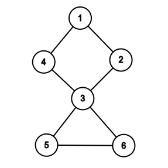
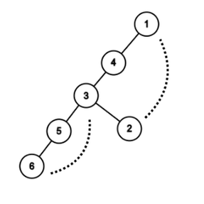

# Articulation points

Here's a example  graph:



Now we dfs it:



There are two back edges: $6$ to $3$ and $2$ to $1$.

---

**Update $low[u]$**

```c++
low[u] = min(low[u], low[v]);
```

When DFS returns, we update $low[u]$. In the above graph, it's $6$ and $5$.

**Back edge handling**

```c++
low[u] = min(low[u], disc[v]);
```

If `v` is already visited and is not the parent of `u`, we found a back edge. In the above graph, it's $6$ and $3$.
